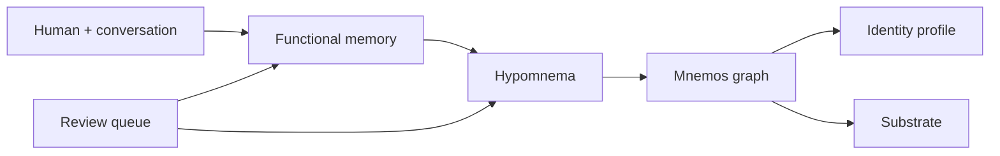

# Turnkey Mnemos Memory System

This is the single-agent path for Mnemos. Multi-agent/shared-memory design is a separate track.

## What The Agent Gets

Mnemos gives an agent four cooperating surfaces:

1. **Functional memory**: current task state, active corrections, commitments, preferences, and open questions.
2. **Hypomnema**: durable scoped continuity for one human/project/agent relationship, still easy to revise.
3. **Mnemos graph**: long-term engrams, connections, beliefs, decay, and reconsolidation.
4. **Visibility**: context packets, review queue, status, and inline Mermaid snapshots.

## Default Session Loop

At the beginning of a meaningful session:

```text
mnemos_session_start
mnemos_context_packet
```

During the session:

```text
mnemos_functional_update
mnemos_hypomnema_write or mnemos_hypomnema_revise
mnemos_remember only for stable long-term memory
```

When the human asks to inspect memory:

```text
mnemos_review_queue
mnemos_visual_snapshot
mnemos_status
```

At the end of the session:

```text
mnemos_session_close
```

That compresses active functional memory into hypomnema. Promotion into Mnemos remains explicit.

## Onboarding Walkthrough

The agent should walk the human through:

1. Agent name and role.
2. Human/person scope.
3. Important starting context and boundaries.
4. Active projects.
5. Optional import path for prior notes or transcripts.
6. Whether the substrate should run in the background.
7. Optional LLM provider for richer memory processing.

The setup wizard seeds:

- foundational hypomnema about the relationship
- active functional memory for onboarding
- initial Mnemos engrams and beliefs

## Memory Rules

- Use functional memory before hypomnema when context is still in motion.
- Use hypomnema before Mnemos when continuity is personal, scoped, or likely to be corrected.
- Mark inferred memory as needing confirmation.
- Revise hypomnema instead of overwriting it.
- Promote to Mnemos only after continuity is stable, salient, and useful beyond the current relationship scope.

## Inline Visual Content

`mnemos_visual_snapshot` returns Markdown with Mermaid:



This lets the agent show the human what the memory system is doing inside the same chat session, without requiring a separate dashboard.
